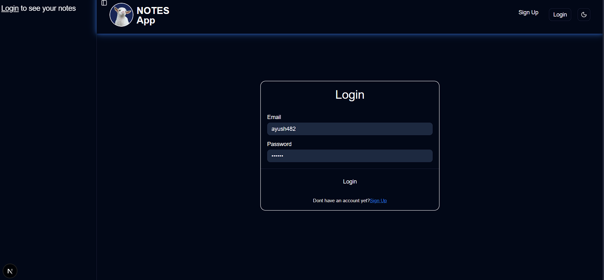

# AI Notes App

This is an AI-powered note-taking app.

## Features

Create, edit, and delete notes
Search notes efficiently
Ask AI questions about your notes
Authentication using Supabase
Fast and optimized UI with Next.js
Modern UI with Tailwind CSS
Database management with Prisma

# Tech Stack

Frontend & Backend
Next.js (App Router)
Database & Auth
Supabase (Auth + Database)
Prisma ORM
Styling
Tailwind CSS
ShadCN UI
AI Integration
OpenAI

# Project Structure

app/ # Next.js app directory
components/ # Reusable UI components
lib/ # Utilities (AI, auth)
db/ # DB, Prisma schema
public/ # Static assets

# Installation & Setup

1. Clone the repository
   git clone https://github.com/your-username/ai-notes-app.git
   cd ai-notes-app

2. Install dependencies
   npm install
3. Setup environment variables

Create a .env file:

# Supabase

NEXT_PUBLIC_SUPABASE_URL=your_url
NEXT_PUBLIC_SUPABASE_ANON_KEY=your_key

# Database (Prisma)

DATABASE_URL=your_database_url

# AI API

OPENAI_API_KEY=your_key

# or

GEMINI_API_KEY=your_key 4. Run the development server
npm run dev

App will run on:
http://localhost:3000

# AI Feature Explanation

User notes are fetched from the database
Notes are sent as context to the AI model
AI answers user queries based on stored notes
Responses are rendered as formatted HTML

# Screenshots

## 🌐 Live Demo

https://notes-app-byhx.vercel.app/

# Author

Ayush Rawat
